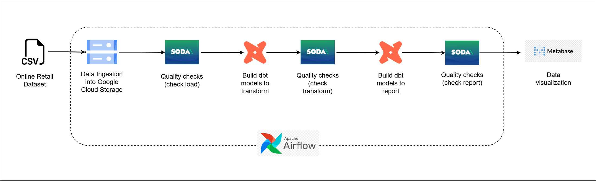
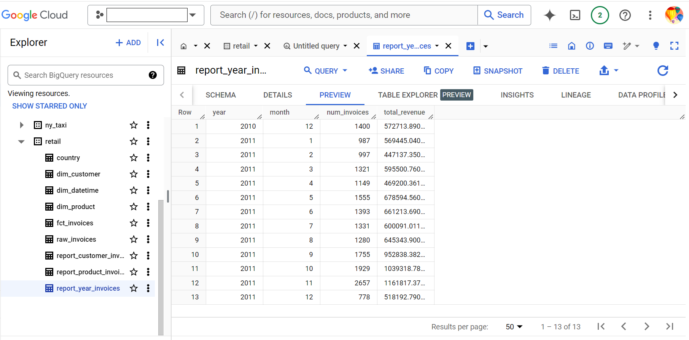
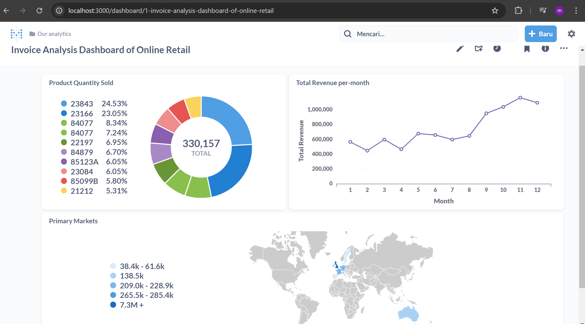
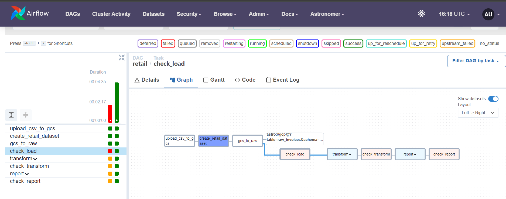

End-To-End Data Pipeline with Astronomer

Overview
========
This project is a demo for building an end-to-end data pipeline that encompasses data modeling, data quality checks, and data visualization using Astronomer for orchestration. The pipeline leverages several popular tools in the data ecosystem, including Apache Airflow, dbt, Soda, Google Cloud Storage, and Metabase to provide a structured data flow from raw data to the final dashboard.

Source: https://www.youtube.com/watch?v=DzxtCxi4YaA&t=2700s


Pipeline
========



Tools
========
1. Apache Airflow (managed by Astronomer): Manages the end-to-end orchestration of the pipeline
2. Astro CLI: For developing, testing, and deploying Airflow DAGs
3. Soda: Performs data quality checks at various stages of the pipeline
4. dbt (Data Build Tool): Transforms data and creates data models
5. Metabase: Visualizes the final processed data
6. Google Cloud Platform (Google Cloud Storage and Google BigQuery)
7. Docker


Workflows Overview
==================

1. Data Ingestion into Google Cloud Storage
The pipeline begins with ingestion of the online retail dataset (in CSV format) into Google Cloud Storage (GCS). This provides a centralized and scalable storage solution for the raw data

2. Quality Checks (Check Load)
Soda is used to perform initial quality checks on the ingested data in GCS. This step ensures data integrity and validates that the data meets defined standards before further processing

3. Data Transformation with dbt
dbt (Data Build Tool) is platform to transform the data. dbt models are created to reshape, aggregate, and prepare the data for analysis and reporting. In this step to create fact and dimensions table
    'include/dbt/models/transform/'

4. Quality Checks (Check Transform)
After the transformation, additional quality checks are executed using Soda to validate the transformed data. This step ensures that the transformations were successful and the data is accurate and consistent

5. Data Reporting with dbt
dbt is further used to build reporting models. These models aggregate and organize the transformed data to provide meaningful insights for end-users and stakeholders
    'include/dbt/models/report/'



6. Quality Checks (Check Report)
A final set of quality checks with Soda is conducted on the reporting models to verify that the reporting data is correct and meets business requirements

7. Data Visualization with Grafana
The pipeline concludes with data visualization in Grafana



Graph
=======



Error Handling
==============

- If there are issues when run 'astro dev start', such as:
Error: error building, (re)creating or starting project containers: Error response from daemon: Ports are not available: exposing port TCP 127.0.0.1:5432 -> 0.0.0.0:0: listen tcp 127.0.0.1:5432: bind: An attempt was made to access a socket in a way forbidden by its access permissions

you can check and stop it on your terminal(powershell):
        ```
        netstat -aon | findstr :5432
        ```
        ```
        taskkill /PID <PID> /F
        ```